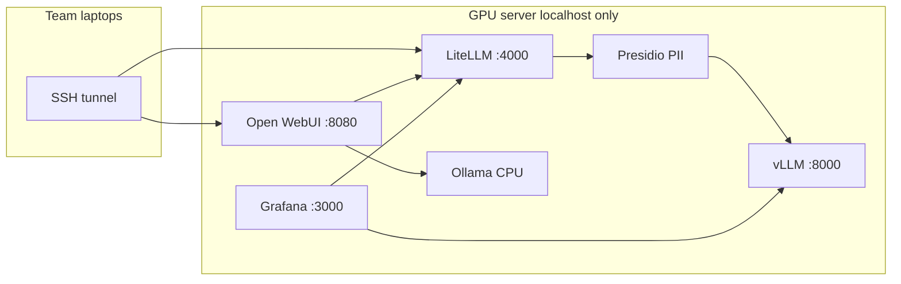

# Deploy Self-Hosted Team AI Stack

**Scope:** Deploy the existing Docker Compose kit on an RTX A6000 server from this repo. The stack is fully configured; implementation is operator setup (`.env` secrets), `docker compose up`, layered verification, first admin user, and SSH tunnel access for the team.

**Decisions (from planning conversation):**
- Hugging Face token and Gemma 4 license: ready
- Team access: SSH port forwarding (not Tailscale in first pass)
- Optional features deferred: SSO, Langfuse, Slack/email alerts

## Checklist

- [ ] Create `.env` from `.env.example` with HF token and generated secrets (`chmod 600`)
- [ ] `docker compose pull && docker compose up -d`; monitor vLLM logs until healthy
- [ ] Run curl checks (vLLM, LiteLLM, chat completion, tool calling); confirm Grafana dashboard
- [ ] Create Open WebUI admin; issue per-user LiteLLM keys via `issue-user-key.sh`
- [ ] Configure UFW (SSH only); document SSH tunnel command for team
- [ ] Install systemd unit, backup cron, and run `load-test.sh` before team rollout

---

## Review summary

This repository is a **production-ready Docker Compose kit**, not application source code. All 14 core services are defined in [`docker-compose.yml`](../docker-compose.yml) with pinned images, health checks, and localhost-only bindings.



| Layer | Status in repo |
|-------|----------------|
| Inference (vLLM + Gemma 4 31B QAT) | Ready — tuned for A6000 in [`.env.example`](../.env.example) |
| API gateway (LiteLLM + Postgres + Presidio) | Ready — [`config/litellm/config.yaml`](../config/litellm/config.yaml) |
| Chat UI + RAG (Open WebUI + Ollama) | Ready — embeddings auto-pulled by `ollama-init` |
| Monitoring (Prometheus, Grafana, Loki, DCGM) | Ready — dashboard pre-provisioned |
| Ops scripts (backup, keys, load test, systemd) | Ready in [`scripts/`](../scripts/) |

**Server verified at planning time:** RTX A6000 (48 GB), NVIDIA driver 535, Docker 29.5, Compose 5.1, GPU-in-Docker working.

---

## Phase 1 — Configure secrets

```bash
cp .env.example .env
chmod 600 .env
```

Edit `.env` and set these **required** values:

| Variable | Action |
|----------|--------|
| `HF_TOKEN` | Hugging Face read token (license accepted) |
| `LITELLM_MASTER_KEY` | `sk-` + `openssl rand -hex 32` |
| `LITELLM_SALT_KEY` | Another random string |
| `POSTGRES_PASSWORD` | Strong password |
| `WEBUI_SECRET_KEY` | `openssl rand -hex 32` |
| `GRAFANA_ADMIN_PASSWORD` | Strong password |

Leave SSO and Langfuse vars empty. vLLM defaults (`VLLM_MAX_MODEL_LEN=16384`, `VLLM_GPU_MEMORY_UTILIZATION=0.92`, `VLLM_MAX_NUM_SEQS=24`) are appropriate for A6000.

**Optional:** pre-download the ~20 GB model:

```bash
export HF_TOKEN="hf_..."
huggingface-cli download google/gemma-4-31B-it-qat-w4a16-ct \
  --local-dir ./models/gemma-4-31b-qat \
  --local-dir-use-symlinks False
```

If pre-downloaded, set `VLLM_MODEL=./models/gemma-4-31b-qat` and add a bind mount under the `vllm` service in `docker-compose.yml`.

---

## Phase 2 — Start the stack

```bash
chmod +x scripts/*.sh scripts/load-test.py
docker compose pull
docker compose up -d
```

**Expect 10–20 minutes** for vLLM to load the model:

```bash
docker compose logs -f vllm
docker compose ps   # all services should reach "healthy"
```

Startup order: Postgres/Presidio → vLLM → LiteLLM → Ollama → Open WebUI → monitoring.

---

## Phase 3 — Layered verification

**1. vLLM (internal)**

```bash
docker compose exec litellm curl -s http://vllm:8000/v1/models | head
```

**2. LiteLLM API**

```bash
source .env
curl -s http://127.0.0.1:4000/v1/models \
  -H "Authorization: Bearer $LITELLM_MASTER_KEY"
```

**3. End-to-end chat**

```bash
curl -s http://127.0.0.1:4000/v1/chat/completions \
  -H "Authorization: Bearer $LITELLM_MASTER_KEY" \
  -H "Content-Type: application/json" \
  -d '{"model":"gemma-4-31b","messages":[{"role":"user","content":"Say hello."}],"max_tokens":64}'
```

**4. Tool calling** — curl test from [README §4.5](../README.md) (Roo Code agents)

**5. Open WebUI** — http://127.0.0.1:8080, register first account (admin)

**6. Grafana** — http://127.0.0.1:3000, confirm **Team AI Overview** dashboard

**7. Capacity check**

```bash
./scripts/check-capacity.sh   # exit 0 = healthy
```

---

## Phase 4 — Team access via SSH

```bash
sudo ufw default deny incoming
sudo ufw allow OpenSSH
sudo ufw enable
```

Do **not** open ports 4000, 8080, or 8000 publicly.

Each team member:

```bash
ssh -N -L 8080:127.0.0.1:8080 -L 4000:127.0.0.1:4000 user@gpu-server
```

- Chat: http://localhost:8080
- API/IDE: `http://localhost:4000/v1` with per-user LiteLLM key

```bash
./scripts/issue-user-key.sh --alias jane.doe
```

---

## Phase 5 — Production ops

| Task | Command |
|------|---------|
| Boot persistence | `sudo ./scripts/install-systemd.sh $(pwd)` |
| Nightly backups | `sudo ./scripts/install-backup-cron.sh --dir /var/backups/team-ai` |
| Load test | `./scripts/load-test.sh` (≥95% success, p95 ≤60s) |
| Image updates | `docker compose pull && docker compose up -d` |

---

## Risks and mitigations

| Risk | Mitigation |
|------|------------|
| vLLM CUDA OOM | Lower `VLLM_MAX_MODEL_LEN` to `8192` or `VLLM_MAX_NUM_SEQS` to `16` |
| HF 401/403 on model pull | Confirm license + `HF_TOKEN`; check `docker compose logs vllm` |
| Slow under load | Tighten per-key `rpm_limit` in LiteLLM UI |
| Prometheus config became a directory | See README Troubleshooting |

---

## Deferred (not in first pass)

- SSO/OAuth configuration
- Langfuse observability overlay (`docker-compose.observability.yml`)
- Tailscale Serve / ACLs
- Alertmanager Slack/email routing
- Phase 11 org deliverables (user guide, `.roo` templates, RAG content curation)

See also: [rag-internal-documents.md](rag-internal-documents.md) for document embeddings after go-live.
